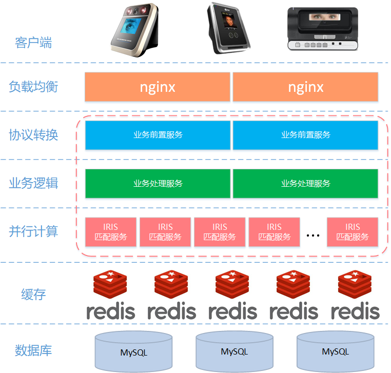

# yrds系统介绍

## 1. 概述

​        yrds系统是IRIS采集和匹配的后台服务系统，主要包括iris设备管理和iris采集/匹配两大部分的功能。整个系统由业务前置子系统、业务处理子系统和IRIS匹配计算子系统三大子系统组成。

## 2. 系统架构

### 2.1 总体架构图

### 2.2 业务前置子系统

​	业务前置子系统的主要功能是数据接收和协议转换，也就说接收从客户端发送过来的数据，并将收到的数据转换位业务处理子系统所需的请求Bean。

​	业务前置系统支持的网络通讯协议主要有两种方式：HTTP和socket长连接方式。

​	业务数据内容格式采用json格式打包。

### 2.3 业务处理子系统

​	业务处理子系统主要功能包括IRIS设备管理、IRIS采集和IRIS匹配的业务逻辑处理。

- IRIS设备管理：设备注册、设备登录、设备连接状态保持、设备批量导入等功能。
- IRIS采集和匹配：IRIS与员工建立关联，并保存数据库。
- IRIS匹配：组织调度匹配模块进行并行计算。

### 2.4 IRIS匹配计算子系统

​	IRIS匹配计算子系统主要功能是对采集的虹膜数据与数据库已关联人员的虹膜进行搜索匹配，从而对被采集人进行识别和认证。本子系统为无状态的并行计算服务，可以根据实际计算需要部署响应的节点。

# 3. 运行环境

| 项目     | 软件和版本          | 备注 |
| -------- | ------------------- | ---- |
| 操作系统 | CentOS 7.2          |      |
| Java环境 | JDK 1.8             |      |
| 数据库   | MySQL Cluster 7.5.9 |      |
| 缓存     | Redis 4.0.8         |      |
| 分布式   | zookeeper 3.4.10    |      |
| 负载均衡 | nginx 1.13.9        |      |